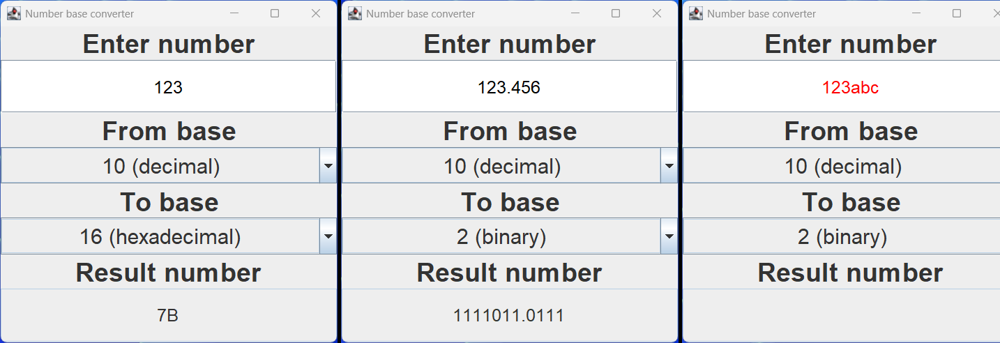

# Number base converter

Java implementation of a number base converter using:
* OpenJDK 25
* Java Swing library
* Maven 3.9.11

**Executable JAR is provided.**

### Features:
* Conversion between real numbers of bases ranging from 2 to 36
* Fractional conversions

Input letters may be both lower-case and upper-case. Output letters are always upper-case.

# Tests
Unit tested using JUnit 5.9.0

# How to run
#### Prerequisites:
* Java 16 or higher

1. Download the latest release zip from:\
   https://github.com/adam-choragwicki/NumberBaseConverter_Swing_Java/releases/latest/download/NumberBaseConverter_Swing_Java.jar

2. Run `java -jar NumberBaseConverter_Swing_Java.jar`
